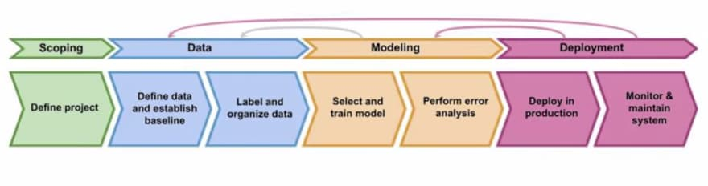

# mlops-exsci-demo
This repo contains an stripped back MLProject and aims to demostrate some key MLOps principles and practices. 

## Aims
* :mechanic: demonstration of some MLOps principles
* :technologist: showcase a variety of experience  
* :astronaut: highlight how a similar system might look outside of this single repo

## Getting Started 
To get the full MLOps experience please continue to run through this README and follow along, at this point you should be in the repos root directory. 

## MLOps
MLOps is responsible for the full lifecycle of a Machine Learning system, the image below is taken from Andrew Ng's Introduction to ML in Production Coursera course and shows the distinct steps of this iterative process.



### Scoping
For the sake of this story we for some reason have been asked to predict the number of rings in a compound using only the image given in the data set. Expectations are;

* Predictions can be obtained from an API
* The model can be retrained as more data becomes avalable 
* The performance of the model is not important (this is a toy example which might not even work!)

In reality scoping is an extremely important part of the MLOps lifecycle! 

### Data 
It is important to build a data pipeline which delivers a consistent set of data for our needs. A simple tool has been developed to do this via the command line, run with;

```
python data-engineering/ingest/upload.py --data_loc raw-data --file_name compounds.json --output_path data-science/data --dlq dlq.log
```

I added some "bad data" to show how the dlq might work, it hasn't been processed but you can have a look;

```
less dlq.log
```

For full details see [the data-engineering README](data-engineering/README.md)

### Modelling 
Both data and modelling are itterative processes. This demo aims to demostrate how this might work in an operational environment. Use the link provided by Docker to access the data-science notebook environment and follow the instructions in `train.pynb`. In the notebook we; 

* Train a simple toy model 
* Evaluate the results (badly) 
* Use MLFlow to track the model performance across runs 
* Save the model 
* Make a second model to demostrate MLFlow logging and deployment patterns

Once the notebook has ran, please go ahead and the following from your command line; 

```
./update-models.sh v1
```

This will update the models for our API and promote v1 to latest. 

A model tracking system such as the one demonstrated here is vital to allow the required iteration on modelling and data. Additional steps could include;
* Saving the model pre-processing steps either as a pipeline to save with the model or as a package to deploy with the API
* Use the MLFlow Model registry backed by s3 to log models and make deployment even easier 
* Use the `data-science` environment to improve the model further 

### Deployment 
For this example I have built a `demo-api`; a super simple API where we can get some model predictions. This locally deployed API could be deployed on AWS ECS or alternative. Our v1 model should be deployed, we can make some calls either in the browser, your favourite tool or with the command line;

```
# Welcome message 
curl -X GET localhost:80

# Check what model versions are avaliable to us 
curl -X GET localhost:80/models/ 

# Make a prediction 
curl -X POST -F "image=@/c/Users/mjackson/projects/mlops-exsci-demo/raw-data/images/1117824.png" localhost:80/predict/
```

Let's promote the v2 model (we can even pretend it was made after v1 had been monitored)

## Next Steps
There are tonnes of things to do! In reality this repo is a reflection of a few different ideas so would likely be split and deployed seperatly. Some ideas to take forward include; 

* Model monitoring is absent from this demo but it is important to track; this could be model metrics e.g. how certain predictions are or even feedback from the user if appropriate. Monitoring allows us to react to changes in data/model performance and alert that retraining may be required 
* Model code is duplicated across training and deployment, packaging or including into the model pipeline is important for consistency
* CI/CD is important for ease and consistency of deplying production systems, given time I would like to 
    * Add pre-commit hooks to ensure things like linting (e.g. Flake/Black) and security are consistently (e.g. Bandit) dealt with before any commits are made
    * GitHub actions (or alternative) could help deploy the API, ensuring any checks and tests are complete before making a release 
    * Extend testing 
    * API monitoring 
* More consistent versioning and requirements management
* Environment specific config (dev, prod etc)
* Lots of model development!! 


